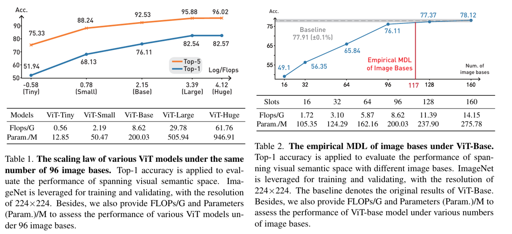
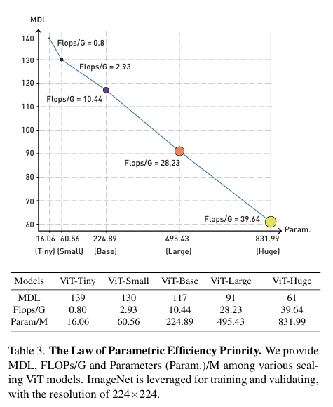
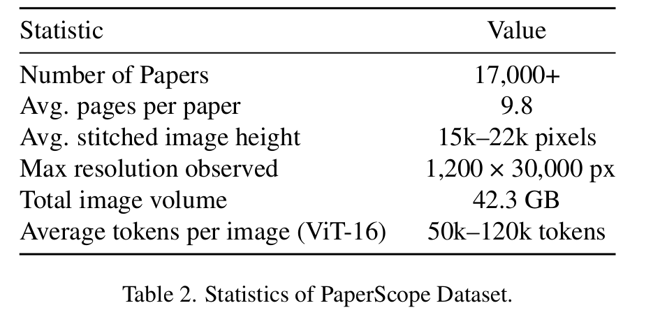

# Fewer Tokens, Greater Scaling


This repository is a PyTorch implementation of resilient contrastive learning proposed in *Fewer Tokens, Greater Scaling: Self-Adaptive Visual Bases for Efficient and Expansive Representation Learning* (submitted)

-----------------------------


This paper investigates the fundamental relationship between model capacity and the minimal number of visual tokens required to preserve image semantics. Inspired by the Minimum Description Length principle, we reinterpret image tokens as vectors in a visual semantic space and define the intrinsic semantic complexity of an image as the smallest set of basis vectors needed to span this space. Building on this perspective, we propose Orthogonal Filtering, a lightweight module that adaptively clusters redundant tokens into a compact set of orthogonal bases. Through extensive experiments across a range of ViT models, we reveal a consistent token–model scaling law: larger models require significantly fewer tokens to span visual semantic space. Besides, we also contribute a visual long-context dataset. 


The code in this repo is copied/modified from [MAE](https://github.com/facebookresearch/mae).

------------------------------------------------------



 we start from the general case and empirically verify that, given the same number of image bases, models with different parameter scales exhibit performance trajectories consistent with the scaling law. We further fix the model architecture to investigate the quantitative relationship between the number of image bases and its attainable performance, through which we derive the empirical Minimum Description Length (MDL) corresponding to each model size. By comparing these empirical MDLs across models of varying capacities, we identify an efficiency frontier that characterizes the trade-off between model capacity and image redundancy. This leads us to formulate **The Law of Parametric Efficiency Priority (PEP)**, which states that *larger models achieve the upper bound of visual performance with fewer image tokens*—providing a theoretical basis and practical guidance for efficient training and scaling of large vision models.




## Training

To training our proposed model with 8 GPUS, run the following command:

```bash
OMP_NUM_THREADS=64 \
torchrun --nproc_per_node=8 \
    --master_port=29502 \
    main_finetune.py \
    --batch_size 1024 \
    --data_path [ImageNet] \
    --model lct_vit_base_patch16 \
    --epochs 100 \
    --blr 1.5e-4 --layer_decay 0.65 \
    --finetune [Pre-trained-CKP] \
    --weight_decay 0.05 --drop_path 0.1 --reprob 0.25 --mixup 0.8 --cutmix 1.0 \
    --output_dir ./output_dir_base \
    --log_dir ./output_dir_base \
    --num_workers 16
```

The detailed fine-tuning instruction is in [FINETUNE.md](./FINETUNE.md).


## Visual Long-Context Dataset: PaperScope

As pioneers in exploring the relationship between the MDL of image bases and model capacity, we deeply recognize the scarcity of large-scale visual long-context datasets, particularly those suitable for training high-capacity vision models. In particular, inspired by DeepSeek-OCR, we envision that vision models can achieve autonomous reasoning through scalable expansion, replicating the remarkable success of large models in the language domain while alleviating the computational bottlenecks commonly encountered in LLMs. 


In this context, a more realistic training dataset for large vision models is required to validate their potential to be trained under the visual long-context. Recognizing the demand for higher-quality visual long-context images, we develop a dataset called PaperScope. This novel dataset consists of 17,365 high-resolution long-context images of papers collected from ICLR 2024 and 2025. It provides a valuable resource for studying visual redundancy and long-context understanding in vision models.



We have upload this dataset on huggingface, you can download using this command:

```bash
git clone https://huggingface.co/datasets/MiaoMiaoYang/PaperScape
```